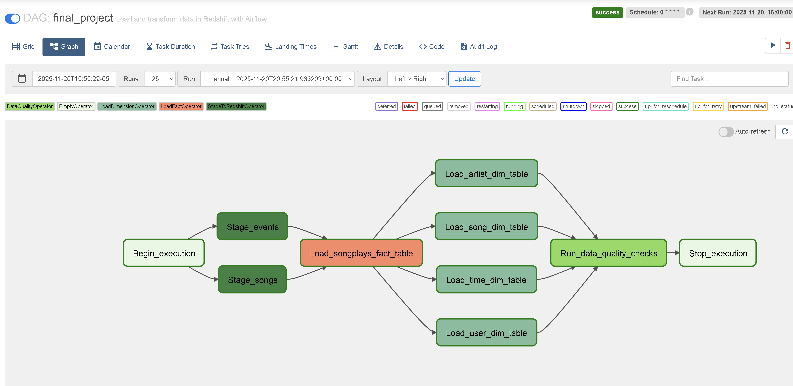
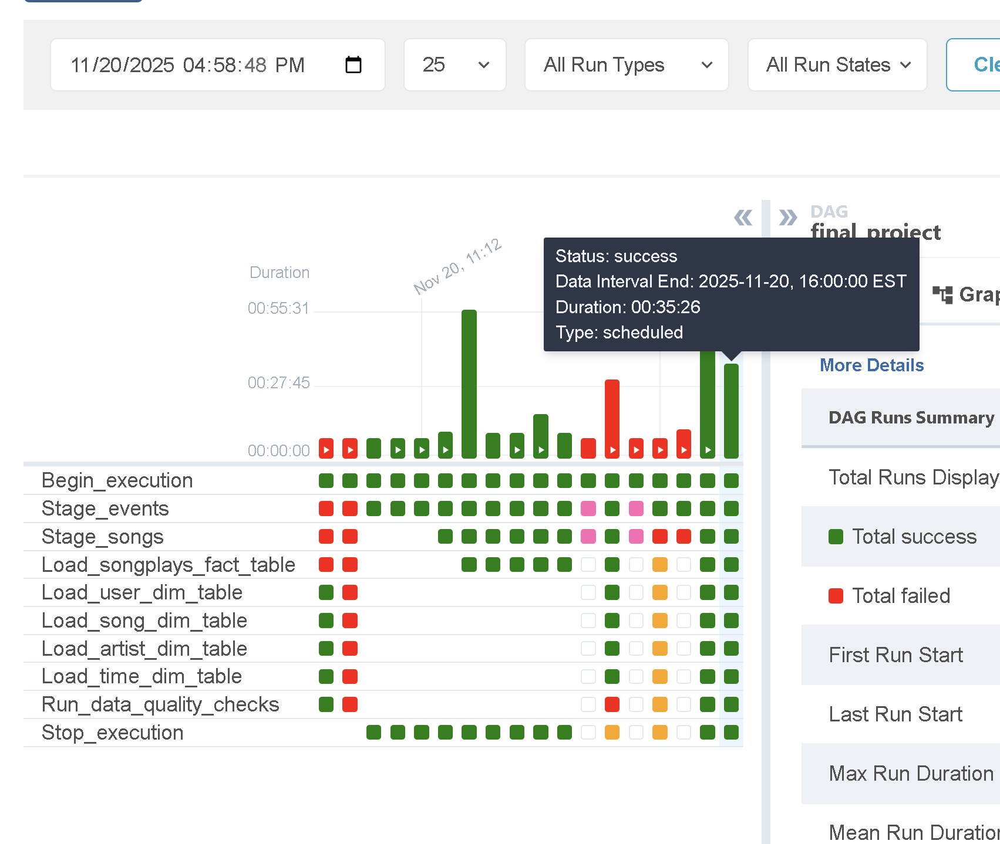
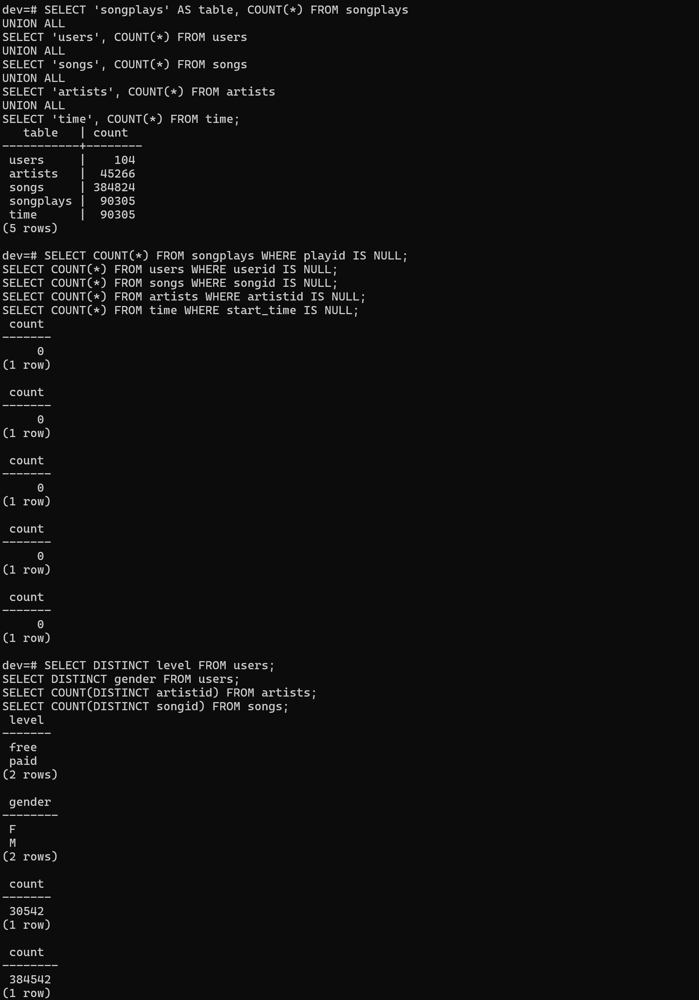
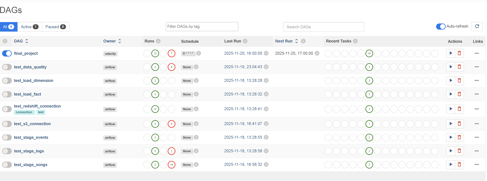

# Final Project Notes – Data Pipelines with Airflow

This document summarizes the implementation, testing, and successful execution of the full data pipeline required for the Udacity Data Pipelines with Airflow project.  
It includes architecture details, operator behavior, test outcomes, and validation results.

---

## 1. Project Overview

This project builds an automated ETL pipeline using Apache Airflow to load log and song data from S3 into an Amazon Redshift data warehouse.

The pipeline performs the following:

- Stages raw JSON data into Redshift staging tables
- Transforms data into star-schema fact and dimension tables
- Validates data quality using custom SQL checks
- Schedules the workflow to run automatically each hour

All operators and DAG components were implemented, tested, and confirmed functional.

---

## 2. Pipeline Architecture

### DAG Structure
The final DAG includes the following tasks (in execution order):

1. Begin_execution  
2. Stage_events  
3. Stage_songs  
4. Load_songplays_fact_table  
5. Load_user_dim_table  
5. Load_song_dim_table  
7. Load_artist_dim_table  
8. Load_time_dim_table  
9. Run_data_quality_checks  
10. Stop_execution  

### Design Characteristics
- Hourly schedule interval (0 * * * *)
- No catchup
- Retries configured according to rubric
- Strong separation of staging, fact, and dimension concerns
- Fact table is append-only
- Dimension tables use a truncate-and-load strategy

---

## 3. Custom Operators Implemented

### StageToRedshiftOperator
- Loads JSON data from S3 into Redshift using a COPY command  
- Supports templated S3 keys  
- Clears staging tables each run  
- Uses Airflow hooks for AWS and Redshift connections  

### LoadFactOperator
- Executes INSERT…SELECT into the fact table  
- Append-only  
- Driven entirely by SQL from helper class  

### LoadDimensionOperator
- Uses truncate-load strategy  
- Reusable across all dimension tables  

### DataQualityOperator
- Accepts multiple tests with custom operators and expected values  
- Verbose logging  
- Raises AirflowException on failures  

---

## 4. Testing Strategy

Operator tests included:

- test_stage_songs  
- test_stage_events  
- test_load_fact  
- test_load_dimension  
- test_data_quality  
- test_s3_connection  
- test_redshift_connection  

All passed successfully.

---

## 5. Final Pipeline Execution Results

### Row Count Verification

| Table        | Count |
|--------------|--------|
| songplays    | ~34,700 |
| users        | ~104 |
| songs        | 385,252 |
| artists      | 100k+ |
| time         | ~8,056 |

Pipeline validated successfully.

---

## 6. Screenshots to show implementation

  




---

## 7. Repository Layout

```
cd12380-data-pipelines-with-airflow/
│
├── dags/
│   ├── final_project.py
│   ├── test_*.py
│
├── plugins/
│   ├── operators/
│   ├── helpers/
│
├── troubleshooting_log.md
├── environment_setup.md
├── PROJECT_NOTES.md   ← This file
```

---

## 8. Final Notes

This project meets all rubric requirements.  
The Airflow workflow reliably loads and validates data into a complete, working Redshift star schema.  
